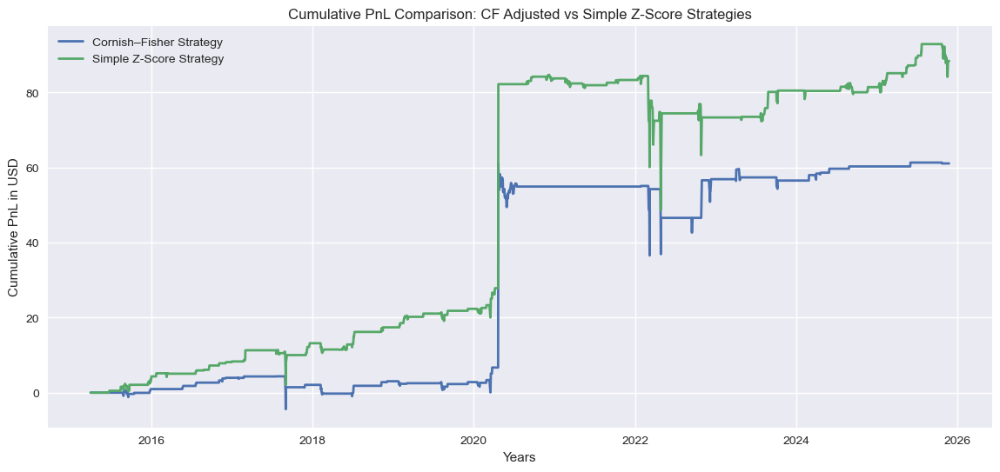
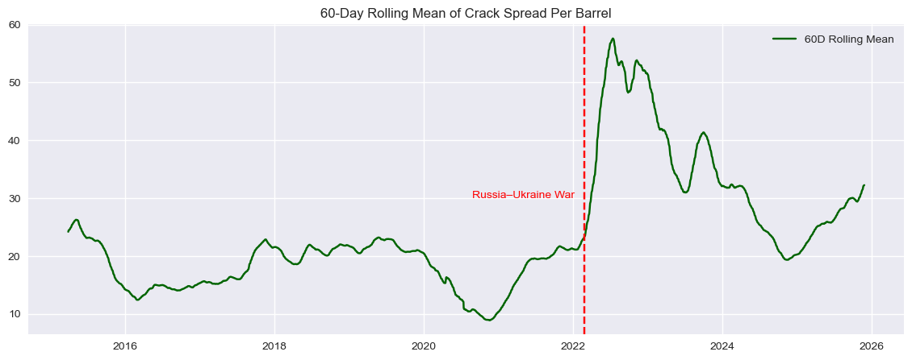

# Crack Spread Trading Strategies: Z-Score vs Cornish–Fisher Adjusted Models

This project builds and backtests two quantitative trading strategies on the **3-2-1 crack spread** using WTI crude oil, RBOB gasoline, and heating oil futures.  
It focuses on the statistical behaviour of refining margins and evaluates how distribution-aware methods perform relative to a simple symmetric z-score model.

---

## 📌 Project Overview

Refining margins (crack spreads) exhibit strong cyclical behaviour and structural shifts, especially after the Russia–Ukraine conflict.  
This project:

- Downloads and cleans daily front-month futures data (2015–2025)
- Converts product prices to $/bbl and constructs the 3-2-1 crack spread
- Analyzes distributional properties (mean, skewness, kurtosis)
- Implements:
  - **Simple 60-day rolling z-score strategy**
  - **Cornish–Fisher adjusted strategy** using rolling skew/kurt and EWMA
- Backtests both models and compares:
  - Cumulative PnL
  - Sharpe Ratio
  - Max Drawdown
  - Number of Trades
  - Profit per Trade
- Examines **macro regime changes** in crack spreads post-2022

---

## 📊 Key Results





- The **Z-Score Strategy** achieves higher total PnL and Sharpe due to more frequent signals.
- The **Cornish–Fisher Strategy** trades far less, resulting in smoother PnL, lower drawdowns, and higher profit per trade.
- Rolling mean and skew plots show a **clear structural rise** in crack spreads and right-tail skew after the Russia–Ukraine conflict.
- Distribution-aware thresholds reduce overtrading during stressed market regimes.

---

## 📁 Repository Structure
```bash
crack-spread-trading/
│
├── data/
│ ├── cf_adjusted_strategy.csv
│ ├── simple_zscore_strategy.csv
│
├── notebook/
│ └── Crack_Spread_Arb.ipynb
│
├── plots/
│ ├── simplez_trading_strat.png
│ ├── cf_trading_strat.png
│ ├── cum_pnl_plots_comparison.png
│ ├── 60day_rolling_skew_plot.png
│ └── 60day_rolling_mean.png
│
├── README.md
├── requirements.txt
└── .gitignore
```

## 🔧 How to Run

1. Install dependencies:
```bash
pip install -r requirements.txt
```
2. Open the notebook:
```bash
jupyter notebook notebook/Crack_Spread_Arb.ipynb
```
Run all cells to reproduce:
- Crack spread construction
- Signal generation
- Backtesting
- PnL and metrics comparisons

## 📜 License

This project is released under the MIT License.

## 🤝 Contributions

Pull requests and suggestions are welcome!
